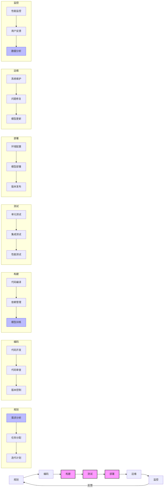

# Water-Consumption-Prediction

## 项目简介

这是一个水消耗预测项目，使用机器学习模型预测水资源消耗情况。

## DevOps流程图

```mermaid
graph LR
    %% DevOps流程的各个阶段
    A[规划] --> B[编码]
    B --> C[构建]
    C --> D[测试]
    D --> E[部署]
    E --> F[运维]
    F --> G[监控]
    G -->|反馈| A
    
    %% 各阶段的详细说明
    subgraph 规划
    A1[需求分析] --> A2[任务分配]
    A2 --> A3[迭代计划]
    end
    
    subgraph 编码
    B1[代码开发] --> B2[代码审查]
    B2 --> B3[版本控制]
    end
    
    subgraph 构建
    C1[代码编译] --> C2[依赖管理]
    C2 --> C3[模型训练]
    end
    
    subgraph 测试
    D1[单元测试] --> D2[集成测试]
    D2 --> D3[性能测试]
    end
    
    subgraph 部署
    E1[环境配置] --> E2[模型部署]
    E2 --> E3[版本发布]
    end
    
    subgraph 运维
    F1[系统维护] --> F2[问题修复]
    F2 --> F3[模型更新]
    end
    
    subgraph 监控
    G1[性能监控] --> G2[用户反馈]
    G2 --> G3[数据分析]
    end
    
    %% 强调CI/CD流程
    classDef cicd fill:#f9f,stroke:#333,stroke-width:2px;
    class C,D,E cicd;
    
    %% 强调数据流程
    classDef data fill:#bbf,stroke:#33f,stroke-width:1px;
    class A1,C3,G3 data;
```

## 技术栈

- 深度学习模型：CNN-LSTM
- 框架：PyTorch
- 模型导出：ONNX
- 数据可视化：Matplotlib